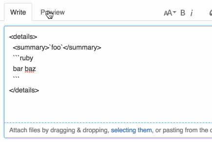

<!-- cerner_2^5_2018 -->
## Collapsible content in Github issues and pull requests

In github markdown we can use [HTML 5 detail tag](https://www.w3schools.com/tags/tag_details.asp) to wrap a bunch of lines. This is specially useful when reporting errors and its back trace in a repository in Github.

```html
<details>
  <summary>`foo`</summary>
  `` `ruby
  bar
  baz
  `` `
</details>
```


